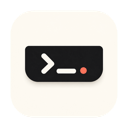

# Islet

原名 Agent Usage Notch。应用名称、安装包和仓库现统一为 Islet，保留原有设置和 Agent 连接。

基于 [boring.notch](https://github.com/TheBoredTeam/boring.notch) 的原生 macOS 刘海应用，集成 [CodeIsland](https://github.com/wxtsky/CodeIsland) 的 Agent 会话监控、订阅剩余量和音乐歌词。

顶部小按钮切换四个页面：**主页 · 暂存器/隔空投送 · Agent · 订阅剩余量**。

## 安装

从 [最新 GitHub Release](https://github.com/Ownera1/Islet/releases/latest) 下载 DMG，将其中的应用拖入“应用程序”。当前历史安装包仍使用 Agent Usage Notch 名称；新构建及后续安装包使用 `Islet.app`。本仓库已公开，源码和安装包均可直接访问，无需 GitHub 登录。

- macOS **15 或更新版本**。
- 通用二进制包含 **Apple Silicon / Intel**。实机运行验证使用 Apple Silicon。
- 当前发行包使用本地签名，**尚未经过 Apple 公证**。首次打开可能需要在“系统设置 → 隐私与安全性”允许。
- 此集成版有独立应用标识和设置，0.1.3 起通过 Sparkle 在应用内检查、下载、验证并安装 GitHub Release 更新。

`v0.1.1` 使用新的“极简终端”应用图标：暖白底色、黑色刘海、终端符号和珊瑚红状态点。Dock、首次引导和设置中的图标预览保持一致。

`v0.1.2` 修复内容滚动误收起刘海的问题：在订阅卡片、Agent 回复等内容区域上下滑动可正常浏览；上滑收起手势仅在顶部导航区域开始时生效，滚动惯性不会触发收起。

`v0.1.3` 加入应用内更新与两种音乐布局。首次从 0.1.2 或更早版本升级仍需手动安装一次；后续由 Sparkle 自动检查，可选择安装或后台下载。

`v0.1.4` 将 agy CLI 与 Antigravity 合并为唯一的 Google AI 额度卡片，并修复终端已登录但 XPC 后台无法访问钥匙串、误报未登录的问题。后台读取不会打开登录网页。

具体步骤见 [INSTALL.md](INSTALL.md)，签名、发布和首次升级说明见 [UPDATES.md](UPDATES.md)。

## 功能

- Agent：Pi、Codex、Claude Code、ZCode、Antigravity。多会话状态、工具调用、任务进度、最近提问、Markdown 回复、来源窗口跳转。
- 一次性工具审批和问题回答。Antigravity 当前为观察模式，审批仍由原应用处理。
- Claude、OpenAI、Google AI 三张额度卡片。Google AI 将 agy CLI 与 Antigravity 作为同一个共享额度池，每 5 分钟同步，显示剩余百分比、重置时间、读取来源和数据更新时间。
- 设置中的三个独立可见性开关，立即生效并持久保存；隐藏卡片不影响后台同步。
- Apple Music 自带歌词优先，缺失时严格匹配网易云歌曲并回退到 LRCLIB。支持 YRC／增强 LRC 逐字时间与普通 LRC 行级扫光，切歌取消旧查询。
- Home 显示当前歌词和下一句预告；引号按钮切换歌词专注模式，日历保留原状态。专注歌词可点击跳转，手动滚动后 4 秒恢复跟随，设置中可微调时间偏移。
- 保留 boring.notch 的原生主页、媒体控制、日历、暂存器和隔空投送等功能。

OpenAI 当前读取 Codex 配额；不代表网页聊天中所有模型的限制。Google AI 优先自动检测并静默读取 agy CLI，失败后读取已运行的 Antigravity 应用；同一共享池只展示一份额度，不相加或平均。Gemini CLI 不参与额度页面或后台轮询。两种 Google 来源均不可用时只显示文字提醒，Google AI 卡片不提供网页跳转。订阅卡片各自的显示开关在设置中保留。

首次使用 Agent 请到 **设置 → Agent 与订阅** 安装对应连接；配置会先备份并保留其他 Hook。详细来源、范围和验证边界见 [INTEGRATION.md](INTEGRATION.md)。

## 开发与打包

需要完整 Xcode、Swift 工具链和 Python 3。Swift 依赖版本保留在工程的 `Package.resolved` 中。

```sh
# 本机 Debug 构建
./scripts/build-app.sh
# 集成测试
swift test --package-path Packages/NotchIntegrations --scratch-path build/IntegrationPackage
# 滚动与收起手势回归测试
./scripts/test-pan-gesture.sh
# 展开背景、顶部贴合和圆角裁剪渲染回归
./scripts/test-notch-surface.sh
# 通用 Release 构建
./scripts/build-app.sh Release 'ARCHS=arm64 x86_64' ONLY_ACTIVE_ARCH=NO
# 在已提交且干净的源码树上打包、验签、生成 SHA-256 和发布清单
./scripts/package-release.sh
# 使用本应用钥匙串中的 Ed25519 密钥生成签名 feed（仅生成文件，不发布）
./scripts/generate-appcast.sh
```

Debug/Release 应用输出到 `build/DerivedData/Build/Products/`，安装包和校验文件输出到 `dist/`。构建产物、研究参考仓库和本机配置均不提交到 Git。GitHub Actions 对 `main` 和 PR 执行测试及通用 Release 编译；推送与工程版本一致的 `v*` 标签后执行签名发布工作流。

此脚本专用于没有 Developer ID 证书的本地签名构建，因此不启用 Hardened Runtime 的 Team ID 框架校验；工程本身保留正式签名时的 Hardened Runtime 配置。打包保留主应用 App Sandbox，并移除调试器访问权限。正式签名和 Apple 公证需要另行提供 Developer ID。

## 上游与许可证

本项目是修改后的 boring.notch 发行版本，保留 **GPL-3.0** 许可证。CodeIsland 以及参考的 CodexBar 集成部分为 MIT，MediaRemoteAdapter 等第三方许可证保留在 [THIRD_PARTY_LICENSES](THIRD_PARTY_LICENSES) 中，亦随安装包提供。

上游版本与改动说明：[UPSTREAM_REVISIONS.md](UPSTREAM_REVISIONS.md)。上游原版介绍：[docs/upstream-boring.notch.md](docs/upstream-boring.notch.md)。
